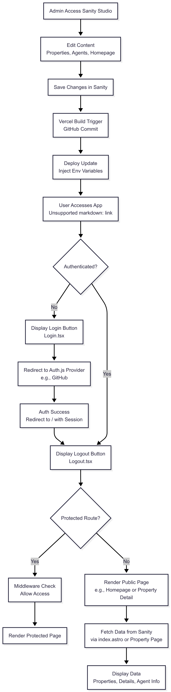

# REAL ESTATE TEMPLATE

## AUTHOR

- Quyen Huynh

## LIVE DEMO

- [Live demo URL]

## PERFORMANCE SCORE

- Mobile: [To be measured]
- Desktop: [To be measured]

## DESCRIPTION

- This document provides everything you need to kick off your next Astro + React web app with TypeScript, integrated with Sanity for content management, styled with Tailwind CSS, and secured with Auth.js authentication!

## TIMELINE

- [To be defined] days

## TASK MANAGEMENT

- [Your GitLab repository board]

## TARGETS

- Develop a responsive real estate website with property listings and detailed views.
- Integrate Sanity for dynamic content management (e.g., properties, agents).
- Ensure high performance and SEO optimization using Astro’s static site generation.
- Provide a user-friendly interface with Tailwind CSS styling.
- Implement secure authentication with login and logout features.
- Deploy the app to Vercel for global accessibility.

## REQUIREMENTS

- Basic knowledge of React, TypeScript, and Astro.
- Node.js v20.x installed on your system.
- pnpm package manager for dependency management.
- Git for version control.
- Access to a Sanity account for content management setup.
- A code editor (e.g., Visual Studio Code) for development.
- An Auth.js provider account (e.g., GitHub OAuth) with client ID and secret.
- A Vercel account for deployment.

## TEMPLATE

Design: [Real Estate](https://www.figma.com/design/AZW6M8lwsb4mGlcG1SvJg9/Real-Estate-Template-%F0%9F%9F%A3-by-Flowbase.co--Community---Copy-?node-id=0-1&p=f&t=d3VeeM9178A0dD7x-0)

## FEATURES

- **Homepage**: Hero section, Featured Properties grid, Trust section, Footer.
- **Property Detail**: Image gallery, Details (bedrooms, etc.), Description, Features, Agent sidebar.
- **Content Management**: Dynamic property listings, agent profiles, editable homepage via Sanity.
- **Technical**: Responsive design, static site generation, TypeScript, Vitest testing.
- **Authentication**: Login and logout features with protected routes using Auth.js.

## AUTHENTICATION

- **Framework**: Uses [Auth.js](https://authjs.dev/) with the `@auth/astro` adapter for framework-agnostic authentication.
- **Providers**: Supports OAuth providers (e.g., GitHub; configure via `.env` with `GITHUB_ID`, `GITHUB_SECRET`, and `AUTH_SECRET`).
- **Login**: Redirects to the selected provider for authentication, accessible via a Login component.
- **Logout**: Allows users to sign out, returning to the homepage.
- **Protected Routes**: Middleware ensures only authenticated users access `/protected` routes.
- **Setup**: Requires environment variables in `.env` and an API route at `api/auth/[...auth].astro`.

## ENVIRONMENT

- Ubuntu/MacOS/Windows
- Visual Studio Code
- GitLab
- Node v20.x
- pnpm

## DEPENDENCIES

- [Storybook](https://storybook.js.org/)
- [ESLint](https://eslint.org/)
- [Vitest](https://vitest.dev/)
- [Prettier](https://prettier.io/)
- [Husky](https://typicode.github.io/husky/#/)
- [Lint-staged](https://github.com/okonet/lint-staged)
- [Commitlint](https://commitlint.js.org/#/)
- [Why-did-you-render](https://github.com/welldone-software/why-did-you-render)
- [@auth/core](https://authjs.dev/)
- [@auth/astro](https://authjs.dev/)

## TESTING TOOL

- [React Testing Library](https://testing-library.com/): Simple testing utilities for querying and interacting with DOM nodes.

## DEBUG TOOL

- [React Developer Tools](https://chrome.google.com/webstore/detail/react-developer-tools/fmkadmapgofadopljbjfkapdkoienihi): Inspect React hierarchies.
- [Responsively App](https://responsively.app/): Test designs across screens.

## TECH STACK

- React (v18+)
- TypeScript
- Astro
- [Sanity](https://www.sanity.io/)
- [Tailwind CSS](https://tailwindcss.com/)
- [Auth.js](https://authjs.dev/)

## DEPLOYMENT

- **Platform**: Deployed on [Vercel](https://vercel.com/), offering global CDN, auto-scaling, and Git integration.
- **Steps**:
  1. Install Vercel CLI: `pnpm add -g vercel`.
  2. Run `vercel` in the project root to deploy or import the GitHub repo via the Vercel dashboard.
  3. Set environment variables (e.g., `GITHUB_ID`, `GITHUB_SECRET`, `AUTH_SECRET`, `SANITY_PROJECT_ID`) in Vercel.
  4. Access the live app at the provided Vercel URL (e.g., `https://real-estate.vercel.app`).
- **Custom Domain**: Optional; configure in Vercel dashboard under "Settings" > "Domains".

## Workflow of the application

## HOW TO RUN

| Syntax                                                             | Description                            |
| ------------------------------------------------------------------ | -------------------------------------- |
| `git clone https://github.com/quyenhuynh-agilityio/astro-training` | Create a copy of the target repository |
| `cd real-estate`                                                   | Change directory to `real-estate`      |
| `pnpm i`                                                           | Installs dependencies                  |
| `pnpm dev`                                                         | Start dev server (Astro)               |
| `pnpm build`                                                       | Build for production                   |
| `pnpm preview`                                                     | Locally preview production build       |
| `pnpm test`                                                        | Start run all tests (Vitest)           |
| `pnpm sanity`                                                      | Start Sanity Studio                    |
